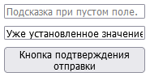

# IT-Compot Backend Methods.

## Содержание
- [Старт проекта](#простой-старт-проекта)
- [Маршруты](#маршруты)
  - [Статические маршруты](#статические-маршруты)
  - [Динамические маршруты](#динамические-маршруты)
  - [Именование маршрутов и перенаправления](#url-naming--redirects-именование-маршрутов-и-перенаправление)
- [Обмен данными клиент - сервер](#обмен-данными-клиент----сервер)
  - [Http методы, form](#Http-методы-form)
  - [Отправка данных клиенту](#Отправка-данных-клиенту)
  - [Виды полей ввода input](#Виды-полей-ввода-input)
- [Модели](#models)
  - [Создание модели и миграции](#создание-простейшей-модели-для-товара)
  - [Fields - полям модели](#model-fields)
  - [ORM](#orm)
  - [Static & Media Files](#static--media-files)
- [Администрирование](#администрирование)
- [Шаблонизация](#шаблонизация)
  - [Использование статических файлов](#Использование-статических-файлов-в-шаблоне)
  - [Передача переменных внутрь шаблона](#передача-переменных-внутрь-шаблона)
  - [Формирование внутренних маршрутов](#Формирование-внутренних-маршрутов-в-шаблоне)
  - [Использование циклов и условий в шаблоне](#использование-циклов-и-условий-в-шаблоне)
  - [Include в шаблонах](#Include-в-шаблонах)
  - [Переменные в Include](#Переменные-в-Include)
  - [Расширение / Наследование шаблонов](#расширениенаследование-шаблонов)
- [Структура проекта](#Структура-проекта)

### В данной шпаргалке представлены ПРИМЕРЫ взаимодействия с фреймворком django.
> `venv_name` `project_name` `app_name`, `app` - это не конкретные названия, это значит, что на этих 
> местах должны быть соответствующие названия (имя приложения, проекта и т.д.). <br>
> для виртуальной среды, приложений проекта. **_Example_** переводится как **_пример_**, это 
> тоже не конкретное название чего-либо.

## <u>Простой старт проекта</u>

1. Создание виртуальной среды с именем venv_name.

    `python -m venv venv_name`

2. Активация виртуального окружения.

    `./venv_name/Scripts/activate`

3. Установка django.
   
   `pip install django`

4. Создание django проекта с именем project_name.
   
   `django-admin startproject project_name`

5. Переходим в директорию созданного проекта.
   
   `cd ./project_name`

6. Запуск сервера django.
   
   `python manage.py runserver`

7. Создание django приложения с именем app_name.
   
   `python manage.py startapp app_name`

8. Добавим созданное приложение в проект.

    ```python
    # settings.py
    INSTALLED_APPS = [
        ...,
        ...,
        'app_name',
    ]
    ```

## <u>Маршруты</u>
Чтобы привязать определенную ссылку к отображению html страницы, <br> нужно добавить желаемую ссылку в urls.py
и создать функцию для рендера html странички.

### Статические маршруты
В данном примере мы соединим ссылку `http://127.0.0.1:8000/some/example/` со страничкой `example.html`.

1. В файле views.py создаем функцию `example_view` которая будет возвращать ответ в формате http с отрендеренным шаблоном `example.html`.
   ```python
   # views.py
   def example_view(request):
       return render(request, 'app/example.html')  
   ```

2. В файле urls.py создаем новый маршрут `some/example/` и соединяем его с функцией `example_view`.
   ```python
   # urls.py
   from django.urls import path
   from app.views import example_view  # импортируем из views.py функцию
   
   urlpatterns = [
       ...
       path('some/example/', example_view),  # связываем адрес и функцию
   ]
   ```
### Динамические маршруты
В данном примере мы будем передавать через ссылку параметры<br> 
`http://127.0.0.1:8000/some/example/1/MnogoTexta`.
1. #### Добавляем в маршрут динамическую часть `<int:id>` и `<str:text>`.<br>
   Здесь `int` и `str` это обозначение ожидаемого типа параметра.<br>
   `int` для чисел `str` для строк.
   ```python
   # urls.py
   urlpatterns = [
       ...
       path('some/example/<int:id>/<str:text>/', example_view),
   ]
   ```
2. #### В файле views.py создаем функцию `example_view` с новыми аргументами.
   ```python
   # views.py
   def example_view(request, id, text):  
       # Дополнительные параметры функции example_view после request должны 
       # называться так же как и параметры в связанной ссылке,.
       return render(request, 'app/example.html')
   ```
   > Теперь когда мы перейдем по ссылке `http://127.0.0.1:8000/some/example/1/MnogoTexta`, 
   > получим в параметр `id` цифру `1`, а в параметр `text` строчку `MnogoTexta`.

### URL naming & redirects (Именование маршрутов и перенаправление)
   * **URL-имя** - это уникальное имя, присваиваемое URL-паттерну в Django. <br>
     Оно позволяет нам ссылаться на этот URL в коде и шаблонах, <br>
     используя понятные и наглядные имена вместо абсолютных URL-адресов.

   * **Redirect** (перенаправление) - позволяет перенаправить пользователя на определенную ссылку.<br>
   * #### Примеры
     * Укажем имена для двух маршрутов
         ```python
         # urls.py
         urlpatterns = [
             ...
             # Примеры со статическим и динамическими маршрутами
             path('some/example/', example_view1, name='example1'),  
             path('some/example/<int:id>/<str:text>/', example_view2, name='example2'),  
         ]
         ```
     * Перенаправление:
          ```python
          # views.py
          # Эти функции эквивалентны в нашем случае
          def some_view(request):
              return redirect('example1')
          
          
          def some_view(request):
              return redirect('some/example/')
          ```
          Так мы перенаправим пользователя на адрес http://127.0.0.1:8000/some/example/ 
          ```python
          # views.py
          def some_view(request):
              return redirect('example2', id=100, text='aaa')
          ```
          А так на http://127.0.0.1:8000/some/example/100/aaa/ <br><br>
     
     * **Шаблонизация маршрутов описана в [этом разделе](#Формирование-внутренних-маршрутов-в-шаблоне)**
     <br><br>

## <span id="Обмен-данными-клиент---сервер"><u>Обмен данными</u> `клиент <--> сервер`</span> 

В контексте обмена данными "клиент-сервер", "клиент" обычно относится к программе или устройству, 
которое инициирует запрос к другой программе или устройству, называемому "сервером". Клиент использует 
сеть для отправки запросов серверу и получения от него ответов. Примерами клиентов могут служить веб-браузер, 
который запрашивает веб-страницы с веб-сервера, или мобильное приложение, которое запрашивает данные с сервера приложений.

### Http методы, form
   Общение в сети в основном происходит по протоколу `http`. <br>
   Это **_ТЕКСТОВЫЙ_** протокол (все передаваемые данные - **_текст_**).<br>
   > Существуют и другие протоколы, например websocket.

   Любой запрос на сервер, будь то загрузка страницы или отправка данных <br>
   на сервер сопровождается определенным типом запроса.<br>
   Например, при обычном переходе по ссылке отправляется `GET` запрос, <br>
   а в ответ мы получаем `html` страницу и связанные css js и т.п. файлы.<br>
    
   Для отправки данных мы используем форму (тег `form`).<br>
   > Отправлять данные можно не только через форму, можно, например, через js.

   Атрибут `method` у тега `form` определяет какой тип запроса будет использоваться при отправке.<br>
   Атрибут `action` у тега `form` определяет на какой адрес будет отправляться запрос.<br>
   
   `method`: post или get, других не добавили.<br>
   `action`: Cсылка, куда будут отправляться данные. Если не указывать, то на ту же страницу.

   HTTP запросы — это основной способ взаимодействия между клиентом 
   (например, веб-браузером) и сервером. Вот описание основных типов HTTP запросов:

   * ### GET
     Используется для запроса данных с сервера. Особенностью GET-запросов является то, 
     что данные, отправляемые на сервер, добавляются в URL в виде пар "ключ-значение". Этот 
     метод подходит для запросов, где информация не должна быть конфиденциальной, 
     так как все данные видны в URL.<br><br>

     Пример GET-запроса с параметрами в адресной строке браузера:
     * `http`://`127.0.0.1:8000`/?`param1=value_1`&`param2=abcd`&`param3=321`&`param4=sometext`/
     * http://127.0.0.1:8000/?param1=value_1&param2=abcd&param3=321&param4=sometext/
     > Перед передачей параметров ставиться `?`, а после пары ключ-значение разделяются запятыми.
   * ### POST
     Используется для отправки данных на сервер для создания или обновления ресурса. 
     Данные отправляются в теле запроса, а не в URL, что делает POST более безопасным 
     выбором для передачи конфиденциальной информации.<br>
   * ### PATCH
     Используется для частичного обновления существующего ресурса. В отличие от POST, 
     который обычно используется для создания новых ресурсов, PATCH применяется для внесения 
     изменений в уже существующий ресурс.<br>
   * ### PUT
     Этот метод похож на POST, но обычно используется для замены существующего ресурса 
     полностью. Если ресурс не существует, он может быть создан.<br>
   * ### DELETE
     Как следует из названия, этот метод используется для удаления ресурса.<br>
   * ### HEAD
     Похож на GET, но используется для получения заголовков ответа без тела. Это полезно 
     для извлечения метаданных и проверки, доступен ли ресурс, не загружая его полностью.<br>
   * ### OPTIONS
     Используется для описания параметров связи с ресурсом. Обычно применяется для 
     проверки поддерживаемых методов HTTP на сервере или для предварительной проверки CORS 
     запросов в веб-приложениях.<br>
   * ### TRACE
     Выполняет вызов обратно к клиенту с полученной информацией. Это помогает клиенту 
     увидеть, что происходит с данными на пути к серверу.<br>
   * ### CONNECT
     Преобразует соединение запроса в прозрачный TCP/IP туннель, обычно используется 
     для SSL (HTTPS) соединений через незашифрованный прокси-сервер.<br>

   * ### Пример
      * Создадим форму для отправки данных.
          ```html
          <!-- example.html -->
          <form method="get" action="">
              <input type="text" name="name1" placeholder="Подсказка при пустом поле.">
              <input type="text" name="name2" value="Уже установленное значение.">
              <input type="hidden" name="name3" value="Невидимое поле">
              <button type="submit">Кнопка подтверждения отправки</button>
          </form>
          ```    
          <br><br>

      * Так как `action` не указан будем получать данные и рендерить страницу в одной функции.<br>
          ```python
          # views.py
          
          def example_view(request):
              # Так мы можем посмотреть данные отправленные с GET запросом, 
              # если их нет, то результатом в консоли будет пустой словарь.
              print(request.GET) 
              # Проверяем Если запрос типа POST
              if request.method == 'POST':
                  # Так можем распечатать содержимое POST запроса.
                  print(request.POST)
                  # Получаем переменные. 
                  # name1, name2, name3, это значения атрибутов name в input тегах.
                  print(request.POST['name1'])
                  print(request.POST['name2'])
                  print(request.POST['name3'])
              return render(request, 'app/example.html')
          ```

### Отправка данных клиенту
Когда пользователь сделал запрос на адрес. Сервер обычно возвращает `html` страницу. 
У нас это происходит когда наша функция возвращает результат выполнения функции `render`.
```python
def example(request):
   return render(request, 'app/example.html', {
       'key1': 'уууу аааа',
       'ABCkey2': 'value2',
   })
```

Теперь мы можем в `example.html` использовать переданную информацию по ключу.
```html
<!-- example.html-->
...
<span>{{ key1 }}<!-- Тут появится 'уууу аааа'--></span> 
<p>{{ ABCkey2 }}<!-- Тут появится 'value2'--></p> 
...
```
> Отметим, что сервер не всегда возвращает html страницы. Множество web сервисов api используют json для общения.

### Виды полей ввода `input`
*   ```html
    Text Input: Однострочный текст.
    <input type="text" name="any_name">
    ```
    
*   ```html
    Password Input: Ввода пароля, текст отображается как маскированный (******).
    <input type="password" name="any_name">
    ```
*   1. [ ] Галôчка :)))
    ```html
    Checkbox Input: Галочка ().
    <input type="checkbox" name="any_name" value="yes">
    ```
    
*   ```html
    Radio Input: Этот тип позволяет пользователю выбирать одну опцию из группы. 
    (Несколько галочек, из которых можно выбрать только 1. name="у всех одинаковый")
    <input type="radio" name="equal_any_name" value="male"> Мужской
    <input type="radio" name="equal_any_name" value="female"> Женский
    ```
    
*   ```html
    File Input: Выбирать и загружать файлы с компьютера.
    <input type="file" name="any_name">
    ```
    
*   ```html
    Hidden Input: Создает скрытое поле, которое может использоваться 
    для передачи данных на сервер БЕЗ отображения на веб-странице.
    <input type="hidden" name="any_name" value="my_secret_value">
    ```
    
*   ```html
    Number Input: Этот тип позволяет пользователю вводить числа.
    <input type="number" name="any_name" min="1" max="100" step="1">
    ```
    
*   ```html
    Date Input: Этот тип используется для выбора даты.
    <input type="date" name="any_name">
    ```
    
*   ```html
    Email Input: Этот тип используется для ввода email-адреса.
    <input type="email" name="any_name">
    ```
    
*   ```html
    URL Input: Этот тип используется для ввода URL.
    <input type="url" name="website">
    ```
    
*   ```html
    Color Input: Этот тип позволяет пользователю выбирать цвет.
    <input type="color" name="favorite_color">
    ```
    
*   ```html
    Range Input: Этот тип создает ползунок для выбора значения из диапазона чисел.
    <input type="range" name="volume" min="0" max="100">
    ```
    
*   ```html
    Search Input: Этот тип используется для создания поля поиска.
    <input type="search" name="search_query">
    ```


## <u>Models</u>

Модель в Django — это `класс` в Python, который определяет структуру 
будущей **таблицы** в настоящей базе данных.<br>
Модель определяет основные поля и поведение данных, которые вы храните. <br>
Каждая модель является абстракцией одной таблицы в базе данных.<br>
Все модели в проекте django создаются в файлах `models.py` внутри папок приложений.<br>
Это не принципиально, но это общепринятая структура проектов django
### Создание простейшей модели для товара
1. Создаем класс модели Person в `models.py`
   ```python
   from django.db import models
   
   class Person(models.Model):
       first_name = models.CharField(max_length=30)
       last_name = models.CharField(max_length=30)
       ...
   ```
   В этом примере мы определяем модель `Person`, которая имеет два поля: <br>
   `first_name` и `last_name`. <br>
   Оба поля являются `символьными` полями `CharField`, что означает, что они предназначены для хранения строк. <br>
   Атрибут `max_length` указывает максимальную длину строки, которую может хранить поле. <br>
   > Существует не только `CharField`, но и другие поля для хранения других типов данных, об этом ниже.

2. Создаем файлы миграций через терминал.

   `python manage.py makemigrations`

3. И выполняем по ним миграцию.

   `python manage.py migrate`

Как результат получаем в базе данных созданную таблицу. <br>
Название таблицы в базе данных будет складываться из названия приложения <br>
и названия класса модели с маленькой буквы.<br>
Например, если модель `Person` находится в приложении `Core`, то после выполнения миграции <br>
название таблицы в базе данных будет `core_person` <br>
При каждом последующем изменении класса модели нужно повторять создание и выполнение файлов миграций,<br>
чтобы таблица в настоящей базе данных соответствовала классу модели.<br>

Так выглядит в базе данных наша таблица Product c уже как бы созданными объектами.<br> 
Обрати внимание, что было добавлено новое поле `id`, 
которое должно быть у каждой таблицы для обеспечения уникальности каждого объекта в таблице.

| **id** | **first_name** | **last_name** |
|:------:|:--------------:|:-------------:|
|   1    |     Harry      |    Potter     |
|   2    |     James      |     Bond      |
|   3    |      Luke      |   Skywalker   |
|   4    |      Tony      |     Stark     |
|   5    |     Shrek      |     Shrek     |

### Model Fields
Коротко о существующих(не всех) полях моделей Django.

* `CharField(max_length=30)` Поле для коротких текстовых строк, где максимальная длина строки составляет 30 символов.


* `TextField()` Поле для длинных текстовых строк без жесткого ограничения на длину.


* `IntegerField()` Поле для целых чисел.


* `PositiveIntegerField()` Поле для целых чисел, но только положительных.


* `FloatField()` Поле для чисел с плавающей запятой.


* `BooleanField()` Поле для логических значений True или False.


* `DateTimeField()` Поле для хранения комбинированных дат и времени.


* `EmailField()` Поле для хранения адресов электронной почты с валидацией формата.


* `ImageField(upload_to='images/')` Поле для хранения изображений с указанием пути для сохранения.


* `ForeignKey(to=Category, on_delete=models.CASCADE)` Поле для создания связи "один ко многим" **с другой моделью Category**. 
   `on_delete=models.CASCADE` означает, что при удалении связанной `модели Category`, все связанные объекты также будут удалены.


* `ManyToManyField(Product, on_delete=models.CASCADE)` Поле для создания связи "многие ко многим" с другой моделью Product.

### Более подробно о полях моделей.
В Django каждое поле модели определяется классом поля (например, CharField), <br> 
который в свою очередь может содержать различные атрибуты для настройки поведения и свойств этого поля. <br>
Атрибуты полей модели можно разделить на две категории: общие и специфические атрибуты.<br>

1. Общие атрибуты:<br>
    Эти атрибуты могут быть применены к большинству типов полей.<br>

    * `null`: Если True, Django будет хранить пустые значения как NULL в базе данных. По умолчанию равно False.<br>
    * `blank`: Если True, поле может быть пустым в формах. Это не относится к базе данных.<br>
    * `choices`: Предоставляет набор возможных значений для поля.<br>
    * `default`: Значение по умолчанию для поля.<br>
    * `help_text`: Дополнительный текст, который отображается в административном интерфейсе рядом с полем ввода для этого поля.<br>
    * `primary_key`: Если True, поле будет первичным ключом для модели.<br>
    * `unique`: Если True, это поле должно быть уникальным во всей таблице.<br>
    * `verbose_name`: Человеко-читаемое имя поля, используемое в административном интерфейсе.<br>

2. Специфические атрибуты:<br>
   Эти атрибуты применяются к определенным типам полей и могут не иметь смысла для других типов.<br>

    * `max_length` (используется в CharField, EmailField и т.д.): Максимальная длина (в символах) для поля в базе данных.<br>
    * `auto_now` и `auto_now_add` (используется в DateField и DateTimeField): Автоматически устанавливают значение поля в <br>
       текущую дату/время при создании объекта (auto_now_add) или при каждом сохранении объекта (auto_now).<br>
    * `upload_to` (используется в FileField и ImageField): Путь, куда файл будет загружен.<br>
    * `decimal_places` и `max_digits` (используется в DecimalField): Количество знаков после запятой и максимальное <br>
      количество цифр в числе соответственно.<br>
    * `related_name` (используется в отношениях, таких как ForeignKey, ManyToManyField и OneToOneField): <br>
      Имя, используемое для обратного доступа от связанной модели.<br>

Это лишь некоторые примеры атрибутов, которые можно использовать в полях моделей Django. <br>
Сочетание этих атрибутов предоставляет мощные возможности для определения структуры данных вашего приложения.

### ORM
_Примеры взаимодействия с моделью Person._<br>
Не забываем импортировать модель перед использованием.

* Получить все объекты
   ```python
   Person.objects.all()
   ```
* Получить один объект по определенным параметрам
   ```python
   Person.objects.get(id=2, gender='male')
   ```
* Отфильтровать объекты
   ```python
   Person.objects.filter(gender='male')
   ```
* Создать новый объект
   ```python
   Person.objects.create(
      name='Голум', 
      gender='male', 
      age=50
   )
   ```
* Изменить поля объекта и сохранить
   ```python
   some_person = Person.objects.get(id=1)  #  получаем объект с id=1
   some_person.name = 'Новое имя'  # изменяем поле name
   some_person.gender = 'female'  # изменяем поле gender
   some_person.save()  # сохраняем изменения
   ```

### Static & Media Files
### Static Files
Статические файлы в веб-разработке, CSS, JavaScript, mp3, ogg, png, jpg и т.д., хранятся на сервере.<br>
Важно отметить, что эти файлы не доступны напрямую через локальные пути сервера для пользователя <br>
(например, `C:/project/app/static/app/css/style.css`).<br>
Это мы как разработчики и сервер знаем, где эти файлы и имеем к ним доступ, <br>
но пользователь не будет иметь доступ к нашему диску `C:/`, _условно_. <br>
Вот и проблема...<br>

Веб-серверы, включая те, что используются в Django, настраиваются для "проксирования" этих статических файлов. <br>
Это означает, каждому статическому файлу будет соответствовать `url-адрес`. <br>
Например, файл, физически расположенный на сервере в папке `C:/project/app/static/app/css/style.css`, <br>
будет доступен через URL вида http://127.0.0.1:8000/static/app/css/style.css. <br>

В этом и суть статических файлов.<br>

Взаимодействие со статическими файлами обеспечивает стандартное приложение `django.contrib.staticfiles`
```python
# settings.py
...
INSTALLED_APPS = [
    'django.contrib.admin',
    'django.contrib.auth',  
    'django.contrib.contenttypes',
    'django.contrib.sessions', 
    'django.contrib.messages',
    'django.contrib.staticfiles', <------------ 
]
```

В django принято хранить статические файлы, как и шаблоны.<br>
То есть локальные пути будут выглядеть как то так:<br>
`/project/app/static/app/css/style.css`<br>
`/project/app/static/app/js/script.js`<br>
`/project/app/static/app/img/logo.svg`<br>
> Обращаем внимание на дублирование папки с названием приложения.

Хранение статических файлов в django.<br>
┣-📂core `Приложение core`<br>
┃    ┣-📂migrations `Файлы миграций`<br>
┃    ┣-📂static `Статические файлы`<br>
┃    ┃    ┣-📂core `Папка дублирущая название приложения`<br>
┃    ┃    ┃    ┣-📂css<br>
┃    ┃    ┃    ┃    ┗-📜bootstrap.min.css<br>
┃    ┃    ┃    ┣-📂img<br>
┃    ┃    ┃    ┗-📂js<br>
┃    ┣-📜__init__.py<br>
┃    ┣-📜apps.py<br>
┃    ┣-📜admin.py `Управление админкой`<br>
┃    ┣-📜models.py `Модели приложения core`<br>
┃    ┣-📜urls.py `Маршруты приложения core`<br>
┗    ┗-📜views.py `Функции приложения core для отображения страниц`<br>

### Media Files
`Media files` в контексте `django` - это файлы **_любого_** типа, загруженные извне(админка, пользовательский интерфейс)<br>
Они точно также проксируются сервером, как и статические файлы, хранятся немного иначе.
```python
# models.py
class Product(models.Model):
    name = models.CharField(max_length=100)
    image = models.ImageField(upload_to='products/images/')
    # ImageField поле в котором будет храниться ссылка 
    # на загруженный медиа файл (в данном случае картинка)
    # upload_to - путь к папке загрузки данных файлов.
    # Полный путь будет показан ниже
```
```python
# project_name/settings.py
...
# Тут указываем адрес для доступа к файлом 
# по ссылке (MEDIA_URL) и локальный путь для хранения на диске(MEDIA_ROOT).

# MEDIA_URL - адрес по которому будут доступны media файлы.
# Вы можете проверить доступ после добавления первого объекта с медиа файлом перейдя по ссылке:
# http://127.0.0.1:8000/MEDIA_URL/products/images/IMAGE_NAME/
MEDIA_URL = '/media/'
# MEDIA_ROOT - локальный адрес хранения media.
# Корневая папка проекта + 'media'
# ./project_folder/media/
MEDIA_ROOT = os.path.join(BASE_DIR, 'media')

# Такие же настройки есть и для статических файлов
STATIC_URL = '/static/'
STATIC_ROOT = BASE_DIR.parent / 'static' # В курсе мы указывать это не будем
...
```
```python
# project_name/urls.py 
from django.conf import settings
from django.conf.urls.static import static

urlpatterns = [
    ...,
    ...,
    ...,
]
#  На сервере media обслуживает серверная служба, 
#  а не django, поэтому только при локальной разработке в debug режиме  
#  мы включаем обслуживание на стороне django, добавляя адреса для media.
if settings.DEBUG:
    urlpatterns += static(settings.MEDIA_URL, document_root=settings.MEDIA_ROOT)
```

## <u>Администрирование</u>
В Django по умолчанию предусмотрена встроенная административная панель, <br>
которая дает возможность управлять объектами базы данных.<br>
Чтобы взаимодействовать с админ-панелью, необходимо зарегистрировать в ней модели.<br>
Для этого создается класс администратора модели, код которого обычно размещается <br>
в файле `admin.py` внутри соответствующего приложения. В этом же приложении находится<br>
файл `models.py`, содержащий определения моделей, которые нужно зарегистрировать в админке.<br>
Пример кода для регистрации модели:

```python
# admin.py
from django.contrib import admin
from .models import MyModel # Импортируем модель которую хотим зарегестрировать в админке

# MyModel имеется ввиду любая ваша модель...

@admin.register(MyModel)
class MyModelAdmin(admin.ModelAdmin):
    list_display = ('field_1', 'field_2', 'field_3', ) # указываем названия полей как в модели
    list_editable = ('field_2', 'field_3', )
```
`list_display`: Этот атрибут определяет, какие поля модели должны <br>
быть отображены на странице списка объектов в админке. <br>
Это массив имен полей модели, которые вы хотите отобразить.<br>

`list_editable`: Этот атрибут указывает поля, которые можно редактировать <br>
непосредственно в таблице списка объектов. Это позволяет быстро вносить <br>
изменения без необходимости перехода на отдельную страницу редактирования <br>
каждого объекта. Поля, указанные в **list_editable**, также должны быть включены в **list_display**.<br>

## <u>Шаблонизация</u>
Благодаря шаблонизатору django мы можем использовать <br> 
переменные внутри шаблона, а также циклы, условия, включения и расширения.

### Отображение переменных переданных в шаблон [тут](#)
Когда отображаем страничку `example.html` мы используем функцию `render`, <br>
которая как раз прогоняет страничку через `шаблонизатор`. <br>
Первым параметром функции мы передаем параметр `request`,<br>
вторым путь до html файла странички в виде строки.
```python
# views.py
def example_view(request):  
    return render(request, 'app/example.html')
```
Чтобы передать переменную в шаблон, нужно третьим параметром в функции `render` <br> 
передать нужную переменную в словаре под каким-либо именем. <br>
Например, ниже мы передаем переменную `param` под именем `param_name`
```python
# views.py
def example_view(request):  
    param = 999
    return render(request, 'app/example.html', {'param_name': param})
```
Тогда внутри `example.html` мы можем отобразить эту переменную используя `{{ param_name }}`.
```html
<!-- example.html -->
<!doctype html>
<html>
<head>
    <title>Document</title>
</head>
<body>
    <!-- После функции render тут появиться 999(значение переменной param) -->
    {{ param_name }}
</body>
</html>
```

### Использование статических файлов в шаблоне
`` - функция которая принимает основным 
аргументом - путь до статического файла из папки static (то есть пишем путь как будто мы уже в папке static), 
и возвращает полный адрес до этого файла (помним, что статические файлы проксируются).

Эта функция нуждается в импорте (``).
```html
<!-- example.html -->
<!-- Загружаем статические файлы -->
  
...
<head>
    ...
    <link rel="stylesheet" href="">
</head>
<body>
    
</body>
``` 
### Формирование внутренних маршрутов в шаблоне
`` - функция которая принимает основным аргументом - имя маршрута/паттерна, 
и возвращает полную ссылку для этого паттерна.
```python
# urls.py
urlpatterns = [
    ...
    # Примеры со статическим и динамическими маршрутами
    path('some/example/', example_view1, name='example1'),  
    path('some/example/<int:id>/<str:text>/', example_view2, name='example2'),  
]
```
```html
<a href="">Кликни на меня</a>
<!-- После рендера такого шаблона мы получим -->
<a href="/some/example/">Кликни на меня</a>
<!-- Такие, неполные ссылки, ведут на адрес состоящий из домена и этой неполной ссылки.-->
<!-- Полный вид итоговой ссылки при переходе будет http://127.0.0.1:8000/some/example/ -->

<!-- Имена можно использовать где угодно внутри шаблона. Вот еще пример.-->
<form action=""></form>

<!-- Для шаблонизации динамических ссылок нужно передавать дополнительно необходимые параметры по порядку.-->
<a href="">Кликни на меня</a>
<!-- Часто требуется передавать в маршрут контекстные данные, например -->  
<a href="">Кликни на меня</a>
```


### Использование циклов и условий в шаблоне
Если мы хотим отобразить много объектов или отобразить объект <br>
только при каких-то условиях, нужно использовать циклы и условия.

Передадим в шаблон все объекты модели Person.
```python
# views.py
def example_view(request):  
    # Получаем все продукты в переменную all_products
    all_person = Person.objects.all() 
    # Рендерим наш шаблон передавая переменную all_products под именем all_products.
    return render(request, 'app/example.html', {'all_person': all_person})
```
Используем цикл и условие, чтобы отобразить все товары, которые имеют цену меньше 500.<br>
Запускаем цикл для перебора товаров.<br>
Каждую итерацию цикла в переменную product будет попадать<br>
новый товар из переменной all_person пока объекты в all_person не закончатся.<br>
Для каждого **_person_** мы проверяем: возраст 500? Если да, то отображаем div с данными товара.
```html
<!-- example.html -->
...
<body>
     
        
            <div class="product">
                <span>{{ person.name }}</span>
                <span>{{ person.age }}</span>
            </div>
        
    
</body>
```
Естественно мы можем передавать несколько переменных в шаблон, а не только одну.
```python
# views.py
def example_view(request):  
    return render(request, 'app/example.html', {
        'param1': 11231,
        'param2': 'Еще параметр',
        'param3': 'и еще',
        'param4': 999,
        'first_person': Person.objects.get(id=1),
    })
```

### Include в шаблонах
`Include` = `включение, вставка`<br><br>
Давайте представим, что у вас есть веб-сайт с несколькими страницами. <br>
На каждой странице есть одинаковое шапка и подвал. <br>
Вместо того чтобы копировать и вставлять одинаковый код шапки <br>
и подвала на каждую страницу, вы можете вынести этот код в <br>
отдельный файл (`header.html` и `footer.html`). <br>
Затем, когда вы создаете основные страницы сайта, вы просто <br>
"включаете" (`include`) эти маленькие файлы шаблонов в нужные места.<br>
Таким образом, если вы захотите что-то изменить в шапке, вам нужно <br>
будет сделать это только в одном файле `header.html`, а изменения <br>
автоматически отразятся на всех страницах, где это меню "включено".<br>
В коде Django это выглядит примерно так:

> Как всегда, шаблоны мы храним в папке `templates`. <br>
> Советую создать внутри отдельную папку для шаблонов, которые мы будем куда-либо вставлять.
```html
<!-- Ваш основной шаблон страницы -->
<div class="header">
    
</div>
<div class="content">
    <!-- Контент вашей страницы -->
</div>
<div class="footer">
    
</div>
```

### Переменные в Include
В Django, тег `` позволяет вставить один шаблон в другой. <br>
Чтобы передать переменные в этот включенный шаблон, вы можете использовать `with`.
```html
<!-- app/main.html -->
...

...
```
```html
<!-- app/includes/card.html -->

<!-- Файл для вставки(include) -->
<div class="card">
    <p>Name: {{ name }}</p>
    <p>Age: {{ age }}</p>
</div>
```
Здесь `card.html` использует переменные `name` и `age`, переданные из `main.html`.


### Расширение/Наследование шаблонов

В Django, наследование шаблонов позволяет расширять шаблоны страниц с общим содержимым и структурой.
Например, каждая страница начинается с 
```html
<!doctype html>
<html lang="en">
<head>
    <meta ...........
```
И вот как раз чтобы постоянно не писать одно и тоже, экономить место и улучшать <br>
качество кода делают базовый шаблон, в котором подобные, часто повторяющиеся вещи, <br>
прописываются 1 раз, а после этот шаблон расширяется контентом уникальным для разных страниц.<br>

```html
<!-- templates/app/base.html -->

<!-- Шаблон который будем заполнять контентом / расширять -->
<html>
<head>
    <title>Default Title</title>
</head>
<body>
    
</body>
</html>
```
```html
<!-- templates/app/page.html -->

<!-- За основу берем base.html и вместо блока content -->
<!-- подставляем свой параграфи или любой другой код, -->
<!-- а вместо блока title надпись 'Page Title' -->


Page Title


    <p>This is the content of the page.</p>

```

В этом примере `page.html` наследует структуру из `base.html` и переопределяет блоки `title` и `content`.
``: указывает, что **текущий** шаблон **наследуется** от `base.html`.<br>
`` ... ``: в базовом шаблоне определяет `блоки`, которые <br>
можно **переопределить** в **дочерних** шаблонах.<br>
Важно заметить, что это самый простой и базовый пример использования наследования/расширения шаблонов.<br>
Цепочка расширения может состоять не только из двух шаблонов. <br>
В базовом приложении `admin` вложенность наследования около 4.

## <u>Структура проекта</u>
Структура директорий в проекте django.
Обратите внимание, что это пример структуры, а не точный её вид.<br><br>
📦PROJECT_NAME `Корневая папка проекта BASE_DIR`<br>
 ┣---📜manage.py<br>
 ┣---📂project_name `Конфигурация проекта`<br>
 ┃    ┣---📜__init__.py<br>
 ┃    ┣---📜settings.py `Настройки проекта`<br>
 ┃    ┣---📜urls.py `Корневые маршруты`<br>
 ┃    ┣---📜wsgi.py<br>
 ┃    ┗---📜asgi.py<br>
 ┣--- 📂core `Приложение core`<br>
 ┃    ┣---📂migrations `Файлы миграций`<br>
 ┃    ┣---📂templates `Шаблоны`<br>
 ┃    ┃  ┣---📂core `Шаблоны core приложения`<br>
 ┃    ┃  ┃  ┗---📜example.html<br>
 ┃    ┣---📂static `Статические файлы`<br>
 ┃    ┃  ┣---📂core `Статические файлы core приложения`<br>
 ┃    ┃  ┃  ┣---📂css<br>
 ┃    ┃  ┃  ┣---📂img<br>
 ┃    ┃  ┃  ┃  ┗---📜image.png<br>
 ┃    ┃  ┃  ┗---📂js<br>
 ┃    ┣---📜__init__.py<br>
 ┃    ┣---📜apps.py<br>
 ┃    ┣---📜admin.py `Управление админкой`<br>
 ┃    ┣---📜models.py `Модели приложения core`<br>
 ┃    ┣---📜urls.py `Маршруты приложения core`<br>
 ┗    ┗---📜views.py `Функции приложения core для отображения страниц`<br>


## Request object Django
В Django, когда запрос (request) поступает во views, <br>
он содержит различные поля и методы, которые помогают <br>
в обработке запроса. <br>
Вот основные поля и атрибуты:
`method`: Строка, указывающая метод HTTP-запроса, например, 'GET', 'POST'.<br>
`path`: Путь запроса, не включая доменное имя и параметры строки запроса.<br>
`GET`: Словарь (QueryDict), содержащий все параметры запроса, переданные через URL (для метода GET).<br>
`POST`: Словарь (QueryDict), содержащий данные, отправленные в теле запроса <br>
(обычно для методов POST, PUT и PATCH).<br>
`FILES`: Словарь, содержащий все загруженные файлы.<br>
`COOKIES`: Словарь, содержащий все cookies, отправленные клиентом.<br>
`session`: Объект сессии, позволяющий сохранять и извлекать данные, специфичные для сессии пользователя.<br>
`user`: Объект пользователя, связанный с текущим запросом. Если пользователь аутентифицирован, <br>
это будет экземпляр User; иначе это будет экземпляр AnonymousUser.
`META`: Словарь, содержащий все доступные HTTP-заголовки. Сюда также входят некоторые другие данные, <br>
такие как IP-адрес клиента и информация о браузере.<br>
`body`: Необработанные данные запроса.<br>
`scheme`: Схема запроса ('http' или 'https').<br>
`content_type`: Тип контента запроса.<br>
`encoding`: Кодировка запроса.<br>

-----------------------------
**© it-compot**<br>
_by Nikita Artasov_


